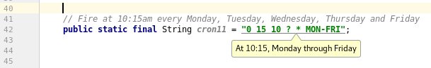
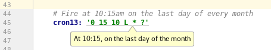
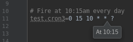
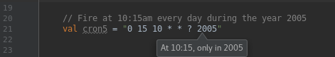

# cron-descriptor
IntelliJ IDEA Plugin to display a human readable description for cron expressions as tooltip.

After installing the plugin open a file in the editor,
detected Cron expressions are now underlined and by hovering over the expression with the mouse a tooltip with the description will be displayed.

**Supports:** Java, Kotlin, Properties, Yaml

|            |
| --------------------------------------------- |
| 01. Example Tooltip, Java with IntelliJ Theme |

|            |
| --------------------------------------------- |
| 02. Example Tooltip, Yaml with IntelliJ Theme |

|           |
| -------------------------------------------------- |
| 03. Example Tooltip, Properties with Dracula Theme |

|           |
| ---------------------------------------------- |
| 04. Example Tooltip, Kotlin with Dracula Theme |